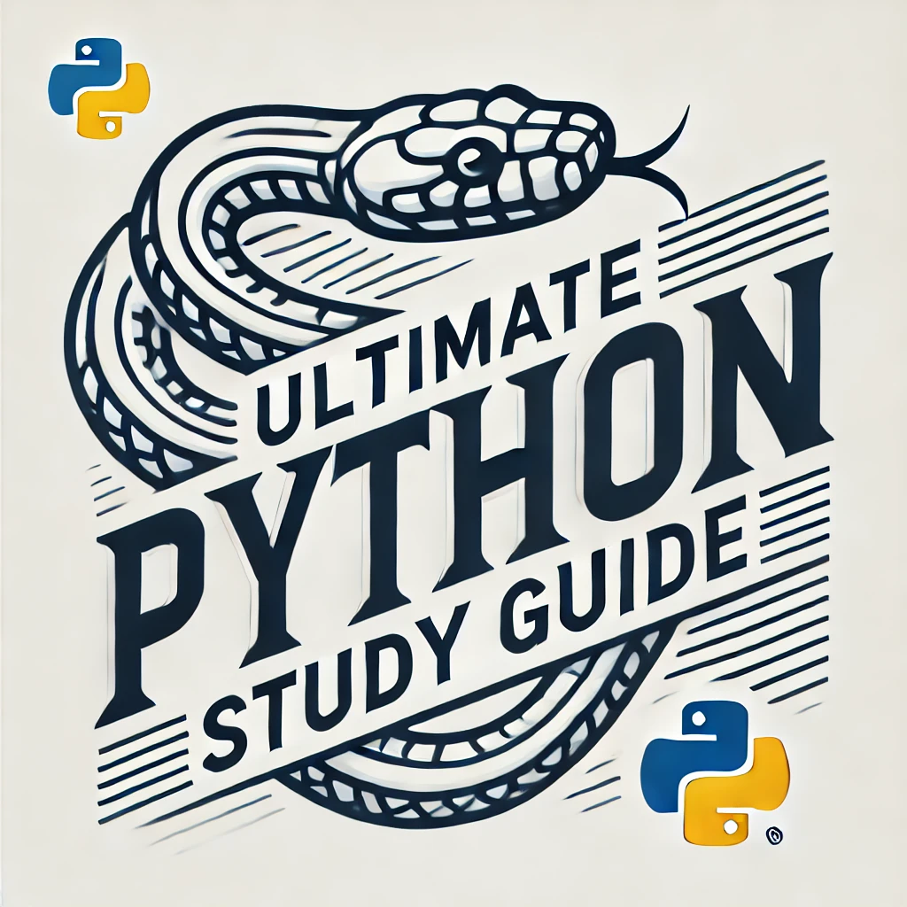

# Guía de estudio "Python Definitivo"

[](https://github.com/huangsam/ultimate-python/actions)
[](https://codecov.io/gh/huangsam/ultimate-python)
[](https://github.com/huangsam/ultimate-python/blob/main/LICENSE)
[](https://www.reddit.com/r/Python/comments/inllmf/ultimate_python_study_guide/)

Guía de estudio "Python Definitivo" para principiantes y profesionales. 🐍 🐍 🐍

```python
print("Guía de estudio 'Python Definitivo'")
```

[English](README.md) |
[한국어](README.ko.md) |
[繁体中文](README.zh_tw.md) |
[Español](README.es.md) |
[Deutsch](README.de.md) |
[Français](README.fr.md) |
[हिन्दी](README.hi.md) |
[Português - Brasil](README.pt_br.md)



## Motivación

Creé este repositorio de GitHub para compartir lo que he aprendido sobre [Python](https://www.python.org/)
durante más de 5 años usándolo como graduado de universidad, empleado en grandes empresas y como contribuidor
de código abierto en repositorios como [Celery](https://github.com/celery/celery) y
[Full Stack Python](https://github.com/mattmakai/fullstackpython.com).
Espero ver a más personas aprendiendo Python y persiguiendo su pasión a través de él. 🎓

## Objetivos

Estos son los objetivos principales de esta guía:

🏆 **Servir como un recurso** para principiantes de Python que prefieren aprender de forma práctica.
Este repositorio contiene una colección de módulos independientes que pueden ejecutarse en
un IDE como [PyCharm](https://www.jetbrains.com/pycharm/) y en el navegador, como
[Replit](https://replit.com/languages/python3). Incluso una terminal sencilla funcionará con los ejemplos.
La mayoría de las líneas de código tienen comentarios útiles que guían al lector paso a paso.
Se anima a los usuarios a modificar el código fuente en cualquier parte siempre y cuando las rutinas
principales (`main`) no se eliminen y los programas se ejecuten con éxito tras cada cambio (ver `runner.py`).

🏆 **Servir como una guía pura** para aquellos que quieren reforzar los conceptos base de
Python. Se utilizan sólo las [librerías integradas](https://docs.python.org/3/library/) para que
estos conceptos puedan adquirirse sin el esfuerzo de aprender conocimientos de dominios específicos.
Por ello no se han instalado librerías y entornos de código abierto populares (como `sqlalchemy`,
`requests`, `pandas`). No obstante, leer el código fuente de estos frameworks es inspirador y altamente
recomendado si tu objetivo es convertirte en un verdadero
[Pythonista](https://www.urbandictionary.com/define.php?term=pythonista).

## Empezando

[](https://replit.com/github/huangsam/ultimate-python)

Haz clic en la imagen de arriba para crear un ambiente de trabajo en el navegador sin necesidad
de tener Git y Python instalados en tu ordenador local. Si estos requisitos ya se cumplen,
puedes clonar el repositorio directamente.

Una vez que el repositorio sea accesible, estás listo para aprender de los módulos independientes.
Para aprender el máximo de cada módulo, lee el código del módulo y ejecútalo.
Hay dos maneras de ejecutar los módulos:

1. Ejecuta un solo módulo: `python ultimatepython/syntax/variable.py`
2. Ejecuta todos los módulos: `python runner.py`

## Contenido

📚 = Recurso externo,
🍰 = Tema principiante,
🤯 = Tema avanzado

1. **Sobre Python**
    - Resumen: [¿Qué es Python?](https://github.com/trekhleb/learn-python/blob/master/src/getting_started/what_is_python.md) ( 📚, 🍰 )
    - Filosofía de diseño: [El Zen de Python](https://www.python.org/dev/peps/pep-0020/) ( 📚 )
    - Guía de estilos: [Guía de estilos para código de Python](https://www.python.org/dev/peps/pep-0008/) ( 📚, 🤯 )
    - Modelo de datos: [Modelo de datos](https://docs.python.org/3/reference/datamodel.html) ( 📚, 🤯 )
    - Librería estándar: [La librería estándar de Python](https://docs.python.org/3/library/) ( 📚, 🤯 )
    - Funciones integradas: [Funciones integradas](https://docs.python.org/3/library/functions.html) ( 📚 )
2. **Sintaxis**
    - Variables: [Literales integrados](ultimatepython/syntax/variable.py) ( 🍰 )
    - Expresiones: [Operaciones numéricas](ultimatepython/syntax/expression.py) ( 🍰 )
    - Bit a bit: [Operadores bit a bit](ultimatepython/syntax/bitwise.py) ( 🍰 ), [Complemento a uno/dos](https://www.geeksforgeeks.org/difference-between-1s-complement-representation-and-2s-complement-representation-technique/) ( 📚 )
    - Condicionales: [if | if-else | if-elif-else](ultimatepython/syntax/conditional.py) ( 🍰 )
    - Iteraciones: [for-loop | while-loop](ultimatepython/syntax/loop.py) ( 🍰 )
    - Funciones: [def | lambda](ultimatepython/syntax/function.py) ( 🍰 )
    - Operador morsa: [Expresiones de asignación :=](ultimatepython/syntax/walrus_operator.py) ( 🤯 )
    - Aplicación de argumentos: [Solo posicional / | Solo palabra clave *](ultimatepython/syntax/arg_enforcement.py) ( 🤯 )
3. **Estructura de datos**
    - Lista: [Operaciones con listas](ultimatepython/data_structures/list.py) ( 🍰 )
    - Tupla: [Operaciones con tuplas](ultimatepython/data_structures/tuple.py)
    - Set: [Operaciones con sets](ultimatepython/data_structures/set.py)
    - Diccionario: [Operaciones con dicts](ultimatepython/data_structures/dict.py) ( 🍰 )
    - Unión de diccionarios: [Fusión de diccionarios | y |=](ultimatepython/data_structures/dict_union.py) ( 🤯 )
    - Comprensión: [list | tuple | set | dict](ultimatepython/data_structures/comprehension.py)
    - Cadena: [Operaciones con strings](ultimatepython/data_structures/string.py) ( 🍰 )
    - Deque: [deque](ultimatepython/data_structures/deque.py) ( 🤯 )
    - Namedtuple: [namedtuple](ultimatepython/data_structures/namedtuple.py) ( 🤯 )
    - Defaultdict: [defaultdict](ultimatepython/data_structures/defaultdict.py) ( 🤯 )
    - Herramientas de iteradores: [Herramientas de iteradores](ultimatepython/data_structures/itertools.py) ( 🤯 )
    - Complejidad de tiempo: [Operaciones de cPython](https://wiki.python.org/moin/TimeComplexity) ( 📚, 🤯 )
4. **Clases**
    - Clase básica: [Definición de básica](ultimatepython/classes/basic_class.py) ( 🍰 )
    - Herencia: [Herencia](ultimatepython/classes/inheritance.py) ( 🍰 )
    - Clase abstracta: [Definición de abstracta](ultimatepython/classes/abstract_class.py)
    - Clase de excepción: [Definición de excepción](ultimatepython/classes/exception_class.py)
    - Clase iteradora: [Definición de iteradora | yield](ultimatepython/classes/iterator_class.py) ( 🤯 )
    - Encapsulación: [Definición de encapsulación](ultimatepython/classes/encapsulation.py)
5. **Avanzado**
    - Decorador: [Definición de decorador | wraps](ultimatepython/advanced/decorator.py) ( 🤯 )
    - Manejo de archivos: [Manejo de archivos](ultimatepython/advanced/file_handling.py) ( 🤯 )
    - Gestor de contexto: [Gestores de contexto](ultimatepython/advanced/context_manager.py) ( 🤯 )
    - Orden de resolución de método (MRO por sus siglas en inglés): [mro](ultimatepython/advanced/mro.py) ( 🤯 )
    - Mixin: [Definición de Mixin](ultimatepython/advanced/mixin.py) ( 🤯 )
    - Metaclase: [Definición de metaclase](ultimatepython/advanced/meta_class.py) ( 🤯 )
    - Hilos: [ThreadPoolExecutor](ultimatepython/advanced/thread.py) ( 🤯 )
    - Asyncio: [async | await](ultimatepython/advanced/async.py) ( 🤯 )
    - Referencias débiles: [weakref](ultimatepython/advanced/weak_ref.py) ( 🤯 )
    - Referencia: [cProfile | pstats](ultimatepython/advanced/benchmark.py) ( 🤯 )
    - Mocking: [MagicMock | PropertyMock | patch](ultimatepython/advanced/mocking.py) ( 🤯 )
    - Expresiones regulares: [search | findall | match | fullmatch](ultimatepython/advanced/regex.py) ( 🤯 )
    - Formatos de datos: [json | xml | csv](ultimatepython/advanced/data_format.py) ( 🤯 )
    - Fecha y hora: [datetime | timezone](ultimatepython/advanced/date_time.py) ( 🤯 )
    - Coincidencia de patrones: [match | case](ultimatepython/advanced/pattern_matching.py) ( 🤯 )

## Recursos adicionales

👔 = Recurso de entrevista,
🧪 = Ejemplos de código,
🧠 = Ideas para proyecto

### Repositorios de GitHub

Sigue aprendiendo leyendo otros buenos recursos.

- [TheAlgorithms/Python](https://github.com/TheAlgorithms/Python) ( 👔 , 🧪 )
- [faif/python-patterns](https://github.com/faif/python-patterns) ( 👔 , 🧪 )
- [geekcomputers/Python](https://github.com/geekcomputers/Python) ( 🧪 )
- [trekhleb/homemade-machine-learning](https://github.com/trekhleb/homemade-machine-learning) ( 🧪 )
- [karan/Projects](https://github.com/karan/Projects) ( 🧠 )
- [MunGell/awesome-for-beginners](https://github.com/MunGell/awesome-for-beginners) ( 🧠 )
- [vinta/awesome-python](https://github.com/vinta/awesome-python)
- [academic/awesome-datascience](https://github.com/academic/awesome-datascience)
- [josephmisiti/awesome-machine-learning](https://github.com/josephmisiti/awesome-machine-learning)
- [ZuzooVn/machine-learning-for-software-engineers](https://github.com/ZuzooVn/machine-learning-for-software-engineers)
- [30-seconds/30-seconds-of-python](https://github.com/30-seconds/30-seconds-of-python) ( 🧪 )
- [ml-tooling/best-of-python](https://github.com/ml-tooling/best-of-python)
- [practical-tutorials/project-based-learning](https://github.com/practical-tutorials/project-based-learning#python)
- [freeCodeCamp/freeCodeCamp](https://github.com/freeCodeCamp/freeCodeCamp) ( 👔 )
- [microsoft/ML-For-Beginners](https://github.com/microsoft/ML-For-Beginners) ( 🧪 )
- [microsoft/Data-Science-For-Beginners](https://github.com/microsoft/Data-Science-For-Beginners) ( 🧪 )
- [Avik-Jain/100-Days-Of-ML-Code](https://github.com/Avik-Jain/100-Days-Of-ML-Code) ( 🧪 )

### Proyectos del autor

Proyectos que he creado con Python que muestran lo que puedes crear después de aprender estos conceptos:

- [huangsam/chowist](https://github.com/huangsam/chowist) ( 🧪 )
- [huangsam/githooks](https://github.com/huangsam/githooks) ( 🧪 )
- [huangsam/ragchain](https://github.com/huangsam/ragchain) ( 🧪 )
- [huangsam/mailprune](https://github.com/huangsam/mailprune) ( 🧪 )

### Práctica interactiva

Continua practicando para que no se oxiden tus habilidades de programación.

- [codechef.com](https://www.codechef.com/) ( 👔 )
- [codeforces.com](https://codeforces.com/)
- [codementor.io](https://www.codementor.io) ( 🧠 )
- [coderbyte.com](https://www.coderbyte.com/) ( 👔 )
- [codewars.com](https://www.codewars.com/)
- [exercism.io](https://exercism.io/)
- [geeksforgeeks.org](https://www.geeksforgeeks.org/) ( 👔 )
- [hackerearth.com](https://www.hackerearth.com/)
- [hackerrank.com](https://www.hackerrank.com/) ( 👔 )
- [kaggle.com](https://www.kaggle.com/) ( 🧠 )
- [labex.io](https://labex.io/exercises/python)( 🧪 )
- [leetcode.com](https://leetcode.com/) ( 👔 )
- [projecteuler.net](https://projecteuler.net/)
- [replit.com](https://replit.com/)
- [w3schools.com](https://www.w3schools.com/python/) ( 🧪 )
- [teclado.com](https://teclado.com/30-days-of-python/#prerequisites) ( 👔 )
- [fullstakpython.org](https://fullstackpython.org/) ( 🧪 )

## Astrónomos en el tiempo

[](https://starchart.cc/huangsam/ultimate-python)
