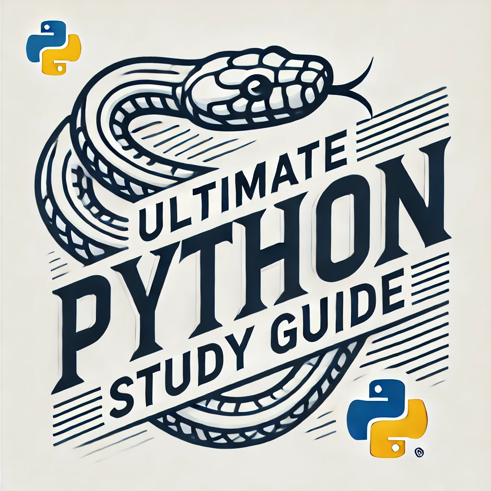

# Ultimate Python - O seu guia de estudos de Python definitivo

[](https://github.com/huangsam/ultimate-python/actions)
[](https://codecov.io/gh/huangsam/ultimate-python)
[](https://sonarcloud.io/dashboard?id=huangsam_ultimate-python)
[](https://github.com/huangsam/ultimate-python/blob/main/LICENSE)
[](https://www.reddit.com/r/Python/comments/inllmf/ultimate_python_study_guide/)

Guia de estudo definitivo de Python para iniciantes e profissionais. 🐍 🐍 🐍

```python
print("Ultimate Python - O seu guia de estudos de Python definitivo")
```

[English](README.md) |
[한국어](README.ko.md) |
[繁体中文](README.zh_tw.md) |
[Español](README.es.md) |
[Deutsch](README.de.md) |
[Français](README.fr.md) |
[हिन्दी](README.hi.md) |
[Português - Brasil](README.pt_br.md)



## Motivação

Eu criei este repositório a fim de compartilhar o que eu aprendi sobre o [básico de Python](https://www.python.org/) nos último 5+ anos de uso como graduado universitário, um empregado em uma empresa de grande porte e um contribuidor de repositórios open-source como [Celery](https://github.com/celery/celery) e
[Full Stack Python](https://github.com/mattmakai/fullstackpython.com).
Eu estou ansiono para ver mais pessoas aprendendo Python e buscando suas paixões através disso. 🎓

## Objetivos

Aqui estão os principais objetivos da criação deste guia:

🏆 **Servir como um recurso** para iniciantes em Python que preferem aprender na prática.
Este repositório possui uma coleção de módulos autônomos que podem ser executados em um IDE como [PyCharm](https://www.jetbrains.com/pycharm/) e no navegador como [Replit](https://replit.com/languages/python3). Até mesmo um terminal simples funcionará com os exemplos.
A maioria das linhas possui comentários cuidadosamente elaborados que guiam o leitor passo a passo sobre o que os programas estão fazendo. Usuários são incentivados a modificar o código fonte em qualquer lugar, desde que as rotinas `main` não sejam excluídas e [sejam executadas com sucesso](runner.py) após cada alteração.

🏆 **Servir como um guia prático** para aqueles que queiram revisitar os conceitos básicos de Python.
Apenas [blibliotecas internas](https://docs.python.org/3/library/) são utilizadas para que esses conceitos possam ser transmitidos sem a sobrecarga de conceitos específicos de domínio.
Dessa forma, bibliotecas e frameworks populares de código aberto (como por exemplo `sqlalchemy`, `requests`,
`pandas`) não são instalados. No entanto, ler o código fonte desses estruturas é inspirador e altamente recomendado se o seu objetivo é se tornar um verdadeiro [Pythonista](https://www.urbandictionary.com/define.php?term=pythonista).

## Começando

[](https://replit.com/github/huangsam/ultimate-python)

Click no emblema acima para criar um ambiente de trabalho no navegador sem a necessidade de instalar Git e Python na sua máquina local. Se esses requisitos já forem atendidos (se você já tem isso instalado), sinta-se à vontade para clonar o repositório diretamente.

Uma vez que o repositório esteja acessível você está pronto para aprender com os módulos independentes. Para aproveitar ao máximo cada módulo, leia o código  do módulo e execute-o.

Existem duas maneiras de rodar os módulos:

1. Execute um módulo único: `python ultimatepython/syntax/variable.py`
2. Execute todos os módulos: `python runner.py`

## Índice

📚 = Recurso externo,
🍰 = Tópico para iniciantes,
🤯 = Tópico avançado

1. **Sobre Python**
    - Visão geral: [O que é Python](https://github.com/trekhleb/learn-python/blob/master/src/getting_started/what_is_python.md) ( 📚, 🍰 )
    - Filosofia de design: [O zen do Python](https://www.python.org/dev/peps/pep-0020/) ( 📚 )
    - Guia de estilo: [Guia de estilo para código Python](https://www.python.org/dev/peps/pep-0008/) ( 📚, 🤯 )
    - Modelo de dados: [Modelo de dados](https://docs.python.org/3/reference/datamodel.html) ( 📚, 🤯 )
    - Biblioteca padrão: [A Biblioteca padrão do Python](https://docs.python.org/3/library/) ( 📚, 🤯 )
    - Funções integradas: [Funções integradas](https://docs.python.org/3/library/functions.html) ( 📚 )
2. **Sintaxe**
    - Variável: [Literais integrados](ultimatepython/syntax/variable.py) ( 🍰 )
    - Expressão: [Operações numéricas](ultimatepython/syntax/expression.py) ( 🍰 )
    - Bitwise: [Operadores bitwise](ultimatepython/syntax/bitwise.py) ( 🍰 ), [Complemento de Um/Dois](https://www.geeksforgeeks.org/difference-between-1s-complement-representation-and-2s-complement-representation-technique/) ( 📚 )
    - Condicional: [if | if-else | if-elif-else](ultimatepython/syntax/conditional.py) ( 🍰 )
    - Loop/Laço: [for-loop | while-loop](ultimatepython/syntax/loop.py) ( 🍰 )
    - Função: [def | lambda](ultimatepython/syntax/function.py) ( 🍰 )
    - Operador morsa: [Expressões de atribuição :=](ultimatepython/syntax/walrus_operator.py) ( 🤯 )
    - Aplicação de argumentos: [Somente posicional / | Somente palavra-chave *](ultimatepython/syntax/arg_enforcement.py) ( 🤯 )
3. **Estrutura de dados**
    - Lista: [Operações de lista](ultimatepython/data_structures/list.py) ( 🍰 )
    - Tupla: [Operações de tuplas](ultimatepython/data_structures/tuple.py)
    - Conjunto: [Operações de conjuntos](ultimatepython/data_structures/set.py)
    - Dicionário: [Operações de dicionários](ultimatepython/data_structures/dict.py) ( 🍰 )
    - União de dicionários: [Fusão de dicionários | e |=](ultimatepython/data_structures/dict_union.py) ( 🤯 )
    - Comprehension: [list | tuple | set | dict](ultimatepython/data_structures/comprehension.py)
    - String: [Operações de String](ultimatepython/data_structures/string.py) ( 🍰 )
    - Deque: [deque](ultimatepython/data_structures/deque.py) ( 🤯 )
    - Namedtuple: [namedtuple](ultimatepython/data_structures/namedtuple.py) ( 🤯 )
    - Defaultdict: [defaultdict](ultimatepython/data_structures/defaultdict.py) ( 🤯 )
    - Ferramentas de iteradores: [Ferramentas de iteradores](ultimatepython/data_structures/itertools.py) ( 🤯 )
    - Time complexity: [Operações de cPython](https://wiki.python.org/moin/TimeComplexity) ( 📚, 🤯 )
4. **Classes**
    - O básico de classes: [Definição de classe](ultimatepython/classes/basic_class.py) ( 🍰 )
    - Herança: [Herança](ultimatepython/classes/inheritance.py) ( 🍰 )
    - Classe abstrata: [Definição de classe abstrata](ultimatepython/classes/abstract_class.py)
    - Classe de exceção: [Definição de Classe de exceção](ultimatepython/classes/exception_class.py)
    - Classe Iterator: [Definição de classe Iterator | yield](ultimatepython/classes/iterator_class.py) ( 🤯 )
    - Encapsulamento: [Definição de encapsulamento](ultimatepython/classes/encapsulation.py)
5. **Avançado**
    - Decorator: [Definição de decorator | wraps](ultimatepython/advanced/decorator.py) ( 🤯 )
    - Manuseio de arquivos: [Manuseio de arquivos](ultimatepython/advanced/file_handling.py) ( 🤯 )
    - Gerenciador de contexto: [Gerenciador de contexto](ultimatepython/advanced/context_manager.py) ( 🤯 )
    - Ordem de resolução do método: [mro](ultimatepython/advanced/mro.py) ( 🤯 )
    - Mixin: [Definição de  mixin](ultimatepython/advanced/mixin.py) ( 🤯 )
    - Metaclass: [Definição de metaclass](ultimatepython/advanced/meta_class.py) ( 🤯 )
    - Thread: [ThreadPoolExecutor](ultimatepython/advanced/thread.py) ( 🤯 )
    - Asyncio: [async | await](ultimatepython/advanced/async.py) ( 🤯 )
    - Referência fraca: [weakref](ultimatepython/advanced/weak_ref.py) ( 🤯 )
    - Benchmark: [cProfile | pstats](ultimatepython/advanced/benchmark.py) ( 🤯 )
    - Mocking: [MagicMock | PropertyMock | patch](ultimatepython/advanced/mocking.py) ( 🤯 )
    - Expressões regulares (regexp): [search | findall | match | fullmatch](ultimatepython/advanced/regex.py) ( 🤯 )
    - Formato de dados: [json | xml | csv](ultimatepython/advanced/data_format.py) ( 🤯 )
    - Datetime: [datetime | timezone](ultimatepython/advanced/date_time.py) ( 🤯 )
    - Correspondência de padrões: [match | case](ultimatepython/advanced/pattern_matching.py) ( 🤯 )

## Recursos adicionais

👔 = Recurso para entrevista,
🧪 = Exemplos de código,
🧠 = Ideias para projetos

### Repositórios GitHub

Continue aprendendo lendo outros recursos bem conceituados.

- [TheAlgorithms/Python](https://github.com/TheAlgorithms/Python) ( 👔 , 🧪 )
- [faif/python-patterns](https://github.com/faif/python-patterns) ( 👔 , 🧪 )
- [geekcomputers/Python](https://github.com/geekcomputers/Python) ( 🧪 )
- [trekhleb/homemade-machine-learning](https://github.com/trekhleb/homemade-machine-learning) ( 🧪 )
- [karan/Projects](https://github.com/karan/Projects) ( 🧠 )
- [MunGell/awesome-for-beginners](https://github.com/MunGell/awesome-for-beginners) ( 🧠 )
- [vinta/awesome-python](https://github.com/vinta/awesome-python)
- [academic/awesome-datascience](https://github.com/academic/awesome-datascience)
- [josephmisiti/awesome-machine-learning](https://github.com/josephmisiti/awesome-machine-learning)
- [ZuzooVn/machine-learning-for-software-engineers](https://github.com/ZuzooVn/machine-learning-for-software-engineers)
- [30-seconds/30-seconds-of-python](https://github.com/30-seconds/30-seconds-of-python) ( 🧪 )
- [ml-tooling/best-of-python](https://github.com/ml-tooling/best-of-python)
- [practical-tutorials/project-based-learning](https://github.com/practical-tutorials/project-based-learning#python)
- [freeCodeCamp/freeCodeCamp](https://github.com/freeCodeCamp/freeCodeCamp) ( 👔 )
- [microsoft/ML-For-Beginners](https://github.com/microsoft/ML-For-Beginners) ( 🧪 )
- [microsoft/Data-Science-For-Beginners](https://github.com/microsoft/Data-Science-For-Beginners) ( 🧪 )
- [Avik-Jain/100-Days-Of-ML-Code](https://github.com/Avik-Jain/100-Days-Of-ML-Code) ( 🧪 )

### Projetos do autor

Projetos que construí com Python que mostram o que você pode criar após aprender esses conceitos:

- [huangsam/chowist](https://github.com/huangsam/chowist) ( 🧪 )
- [huangsam/githooks](https://github.com/huangsam/githooks) ( 🧪 )
- [huangsam/ragchain](https://github.com/huangsam/ragchain) ( 🧪 )
- [huangsam/mailprune](https://github.com/huangsam/mailprune) ( 🧪 )

### Prática interativa

Continue praticando para que suas habilidades de codificação não enferrujem.

- [codechef.com](https://www.codechef.com/) ( 👔 )
- [codeforces.com](https://codeforces.com/)
- [codementor.io](https://www.codementor.io) ( 🧠 )
- [coderbyte.com](https://www.coderbyte.com/) ( 👔 )
- [codewars.com](https://www.codewars.com/)
- [exercism.io](https://exercism.io/)
- [geeksforgeeks.org](https://www.geeksforgeeks.org/) ( 👔 )
- [hackerearth.com](https://www.hackerearth.com/)
- [hackerrank.com](https://www.hackerrank.com/) ( 👔 )
- [kaggle.com](https://www.kaggle.com/) ( 🧠 )
- [labex.io](https://labex.io/exercises/python)( 🧪 )
- [leetcode.com](https://leetcode.com/) ( 👔 )
- [projecteuler.net](https://projecteuler.net/)
- [replit.com](https://replit.com/)
- [w3schools.com](https://www.w3schools.com/python/) ( 🧪 )
- [teclado.com](https://teclado.com/30-days-of-python/#prerequisites) ( 👔 )
- [fullstakpython.org](https://fullstackpython.org/) ( 🧪 )

## Astrônomos no tempo

[](https://starchart.cc/huangsam/ultimate-python)
